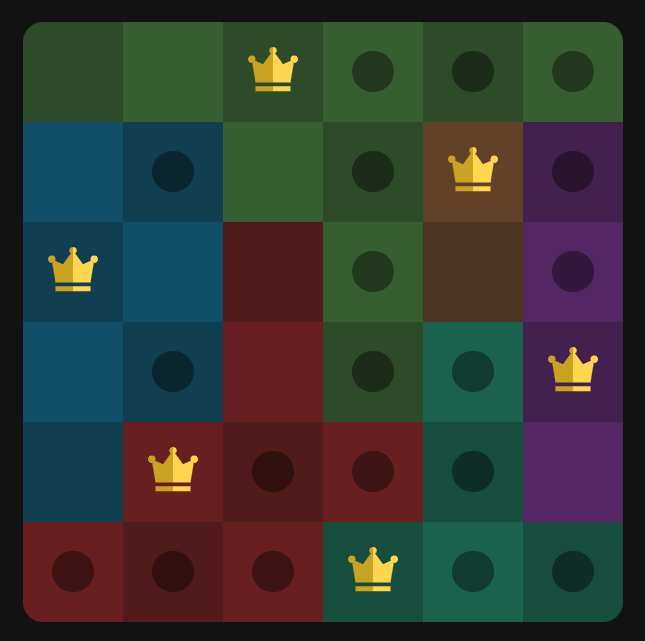

# Queens game

This is very early version of the Queens game. Inspired from LinkedIn Queens puzzle. There is infinite level generation.



## Play

Try it here: [Queens](https://queens.andrax.dev)

## How to play

1) You need to place a queen on the board to each row, column and color region.
2) The queens must not touch each other even diagonally.
3) Each row, column and color region can contain only one queen.

## License

```angular2html
Copyright (c) 2025 Dmytro Ostapenko. All rights reserved.

Licensed under the Apache License, Version 2.0 (the "License");
you may not use this file except in compliance with the License.
You may obtain a copy of the License at

  http://www.apache.org/licenses/LICENSE-2.0

Unless required by applicable law or agreed to in writing, software
distributed under the License is distributed on an "AS IS" BASIS,
WITHOUT WARRANTIES OR CONDITIONS OF ANY KIND, either express or implied.
See the License for the specific language governing permissions and
limitations under the License.
```
