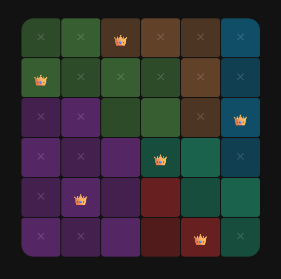

# Queens game

This is very early version of the Queens game.

## How to play

1) You need to place a queen on the board to each color region.
2) The queens must not touch each other even diagonally.
3) Each row, column and color region can contain only one queen.
